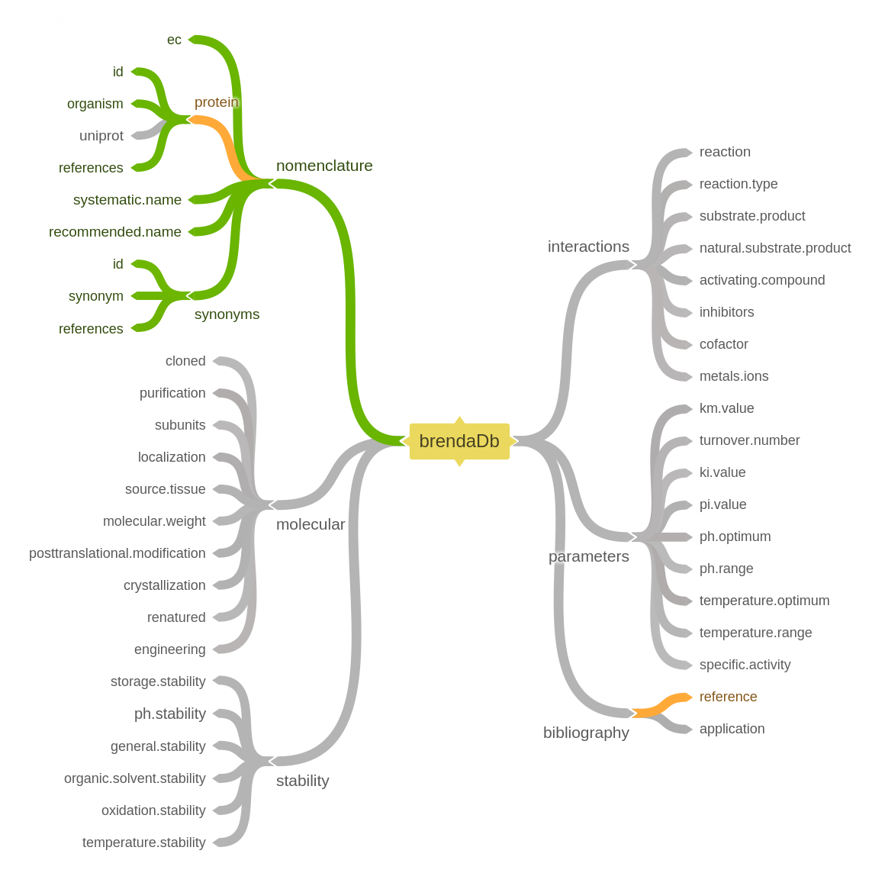

brendaDb
========

<!-- Badges: start -->
[](https://travis-ci.org/y1zhou/brendaDb) [](https://codecov.io/gh/y1zhou/brendaDb) <!-- Badges: end -->

Overview
--------

`brendaDb` aims to make importing and analyzing data from the [BRENDA database](https://www.brenda-enzymes.org) easier. The main functions include:

-   \[x\] Read [text file downloaded from BRENDA](https://www.brenda-enzymes.org/download_brenda_without_registration.php) into an R `data.table`
-   \[ \] Retrieve information for specific enzymes
-   \[ \] Query enzyme information for specific pathways
-   \[ \] Generate enzyme activity profiles based on temperature, pH, etc.



Installation
------------

``` r
# install.packages("devtools")
devtools::install_github("y1zhou/brendaDb")
```
